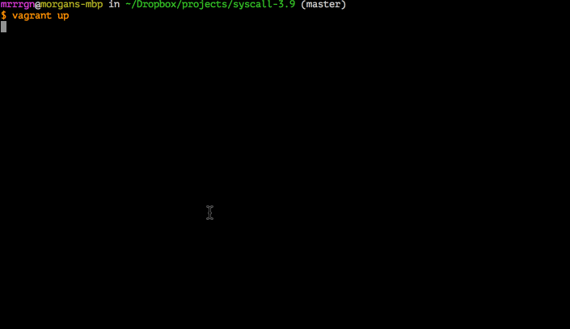

syscall-3.9
===============

A Vagrantfile which upgrades its kernel on boot.  A new [toy] system call is added in the process.

</img>

## Usage

`` vagrant up `` Then, once it finishes compiling the kernel run `` vagrant reload `` to have access to any features added from the patches directory. 

## kernel patches applied

#### callcount.diff
This patch creates a system call (number 314) which increments an unsigned long each time it's called and copies its value to the address passed in.
   
   ``long sys_callcount(unsigned long * num);``

To try out the system call compile /vagrant/callcount_example.c:

    $ gcc /vagrant/callcount_example.c -o callcount_example
    $ ./callcount_example
    $ You've called me 1 times.
    $ ./callcount_example
    $ You've called me 2 times.

#### taskcount.diff
Installs a new system call (315) which returns a count of all running tasks, and dumps a small amount of information about each one to /var/log/messages. 
  ``long sys_taskcount(unsigned long * num);``

    $ gcc /vagrant/taskcount_example.c -o taskcount_example
    $ ./taskcount_example
    $ The system has X processes. 

## Systems Programming Day

Tickets: https://www.eventbrite.com/e/systems-programming-day-tickets-12460107517

Slides: https://docs.google.com/presentation/d/16Ke079yt8pjQ0XNVNEB7Jsv3URiqAVoebBaalAb9TW0/edit?usp=sharing
